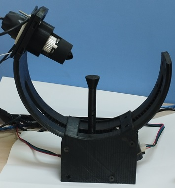

#  
 3D-microscopic-scanner. 

##  
 DIY 3D scanning system for microscopic scale. 

#  
 Prototyping Lab, RDI, Faculty of BioTech, MSA University. 

 Authors: Mariam Attia, Doha Ibrahim, Mai Torkey, Ahmed Gomaa. 

 
 

Microscopic 3D Scanner for Plant Microorganisms and microecology

**Description:**

Welcome to our open-source project – the Microscopic 3D Scanner for Plant Microorganisms. This innovative scanner is designed to delve into the microscale world, allowing researchers, botanists, and enthusiasts to explore and study tiny organisms such as fungi on the roots or branches of plants with a magnification range of 5-10X.

**Check Our Video:** https://www.youtube.com/watch?v=-S-5wSZ8l40

**Features:**

    Openscan Foundation:
    Our project is built upon the foundation of Openscan, an open-source 3D scanning system. We've taken this powerful DIY scanning system and tailored it to meet the specific needs of microscale organism exploration.

    Digital Microscope Integration:
    The traditional camera holder of the Openscan system has been replaced with a digital microscope to enhance the precision and quality of the captured images. This modification allows for a clearer and more detailed visualization of microorganisms.

    Arduino-Based Circuits:
    We've upgraded the original circuits to Arduino-based technology, providing a more versatile and customizable platform. The Arduino integration enhances the control and automation of the scanning process, making it user-friendly and accessible to a wider audience.

**How to Use:**

    Assemble the hardware components according to the provided instructions.
    Upload the Arduino-based firmware to the scanning system.
    Connect the digital microscope and ensure proper calibration.
    Place the plant sample under the microscope and initiate the scanning process.
    Explore the 3D digital representation of the microscale organisms using Openscan software.

**Find the designs:**https://sketchfab.com/ahmed.gomaa085/collections/3d-micro-scanning-project-f8bf683372274e37a971e183b6993895

**Contribution and Collaboration:**

We invite the community to contribute to the development of this project. Whether you're an expert in 3D scanning, Arduino programming, or biology, your insights and contributions are valuable. Feel free to submit issues, pull requests, or join our discussions to help us improve and expand the capabilities of our Microscopic 3D Scanner.

**Publication:**

Check out our preprint publication for an in-depth understanding of the project and its applications. The publication is available here.

**Find our Preprint:** https://doi.org/10.6084/m9.figshare.25466896.v5
**License:**

This project is released under the [name of the license] license. Please review the license file for detailed information.

Join us on this exciting journey of exploring the microscale world and contributing to the advancement of plant biology research!
